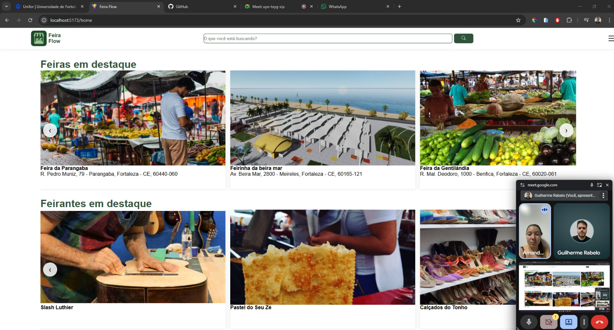
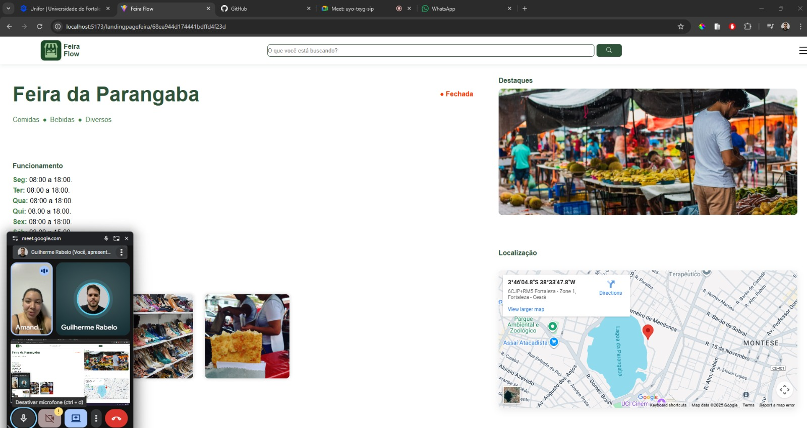
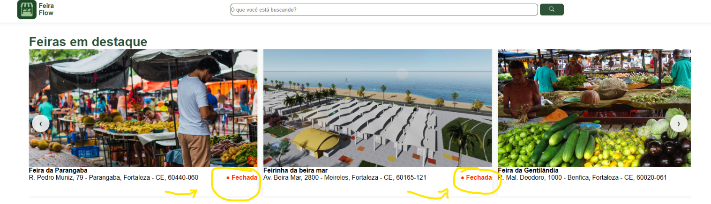
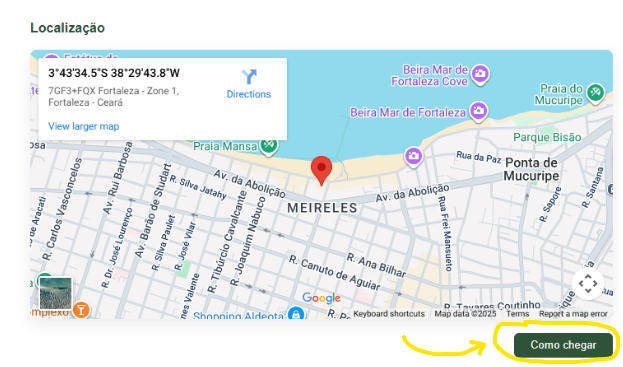

# Sugestões de Melhoria Implementadas
---

## Comentário do Usuário (Amanda Havila - Consumidora)
> "Seria interessante se na tela inicial já aparecesse se a feira está aberta ou fechada, sem precisar entrar nos detalhes.  
> E também poderia ter um botão 'Como Chegar' na página da feira, pra facilitar o acesso pelo Google Maps."

*(Comentário coletado via formulário de feedback durante a reunião de validação).*

---

## Evidências

### Print da reunião de validação
📎   
📎   

---

### Print das telas após as melhorias

Agora, a **home** exibe o status de funcionamento da feira e a **landing page** inclui o botão **“Como Chegar”**, integrado ao Google Maps.

---

## Resultado
As duas melhorias sugeridas foram **implementadas com sucesso**