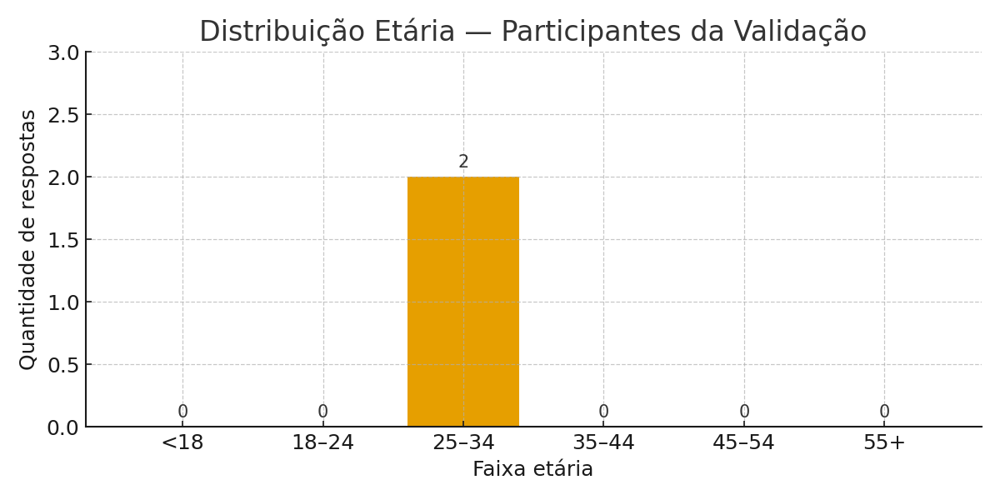
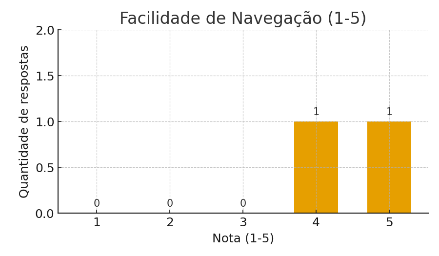
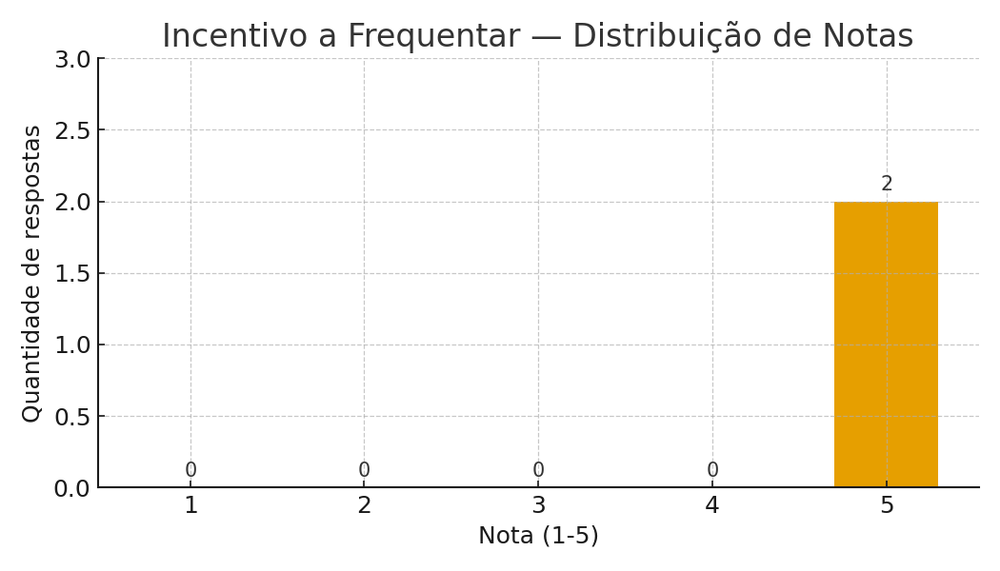

## Relatório de Validação — FeiraFlow

**Data da apresentação:** entre 10/11/2025 e 15/11/2025
**Local / formato:** Reunião online (Google Meet) e demo da aplicação, com coleta de feedback (Google Form)
- Público‑alvo convidados: Amanda Havila — consumidora; Gabriel Lima — filho de feirante

---

## 1. Objetivo da validação
Validar com público-alvo as funcionalidades principais da plataforma FeiraFlow, coletar feedbacks e sugestões.

## 2. Materiais e preparações
- Ambiente preparado: backend rodando em `http://localhost:3000`
- Frontend: Vite (dev server) aberto em `http://localhost:5173`
- Arquivos para evidência: prints de tela e autorização de uso de imagem.
- Formulário de feedback (Google Forms) enviado para participantes.

## 3. Resultados e feedback coletado (resumo)
### Comentários destacados:
- **Consumidor:** "Seria interessante se na tela inicial já aparecesse se a feira está aberta ou fechada, sem precisar entrar nos detalhes.  E também poderia ter um botão 'Como Chegar' na página da feira, pra facilitar o acesso pelo Google Maps."  
  - **Ação tomada:** sugestão implementada — status aberto/fechado visível na Home; botão "Como Chegar" adicionado na landing page.
- **Filho de feirante:** "Essa plataforma ajudaria muito meu pai pois facilitaria a divulgação."  
  - **Ação tomada:** feedback registrado;

## 4. Ajustes implementados a partir do feedback
- **Mostrar status na Home:** Implementado — cálculo baseado em `agendaSemanal` e apresentado nos cards da Home. (Arquivos: `frontend/src/components/HomeFeiras.jsx`, `HomeFeirantes.jsx`)
- **Botão "Como Chegar":** Implementado — redireciona para Google Maps com `destination=lat,lon` (Arquivo: `LandingPageFeira.jsx`, `LandingPageFeirante.jsx`)

## 5. Análise de resultados quantitativos
###  Faixa etária dos participantes

### Frequencia de comparecimento em feiras

### Facilidade de navegação

### Incentivo a frequentar mais feiras, usando o FeiraFlow

## 6. Conclusão
A validação com o público-alvo foi realizada conforme planejado. As sugestões principais foram implementadas. Documento e evidências organizados em `validation/`.

---

